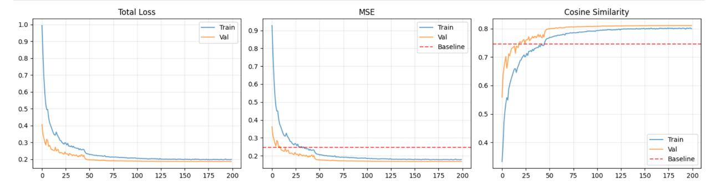

# Unmute Voice - Fine-tuned Mimi Encoder for Voice Cloning

Open-source encoder weights for voice cloning with Kyutai TTS, trained to replicate their proprietary speaker embedding model.

**Note:** This is a post-mortem of a one-shot experiment. Expect rough edges if you try to use it.

## Credits

This work builds upon two incredible open-source projects:

- **[Kyutai Labs TTS](https://github.com/kyutai-labs/delayed-streams-modeling)** - State-of-the-art real-time TTS with Mimi codec.
- **[David Browne's Mimi-Voice](https://huggingface.co/DavidBrowne17/Mimi-Voice)** - Earlier approach to train a voice-cloning embedding model

## What's Inside

- `best_encoder.pt` (85MB) - Fine-tuned Mimi encoder weights + adapter
- `finetune.ipynb` - Training notebook with full methodology
- `generate.py` - Inference script to create voice embeddings
- `training.jpg` - Training curves showing convergence

## Approach

Kyutai's TTS uses a proprietary speaker embedding model (checkpoint signature `1e68beda@240`) that converts 10 second voice samples into a latent representation. We replicate this by:

1. **Partial fine-tuning** - Unfreeze last 2 layers of Mimi encoder (12.5% of parameters)
2. **Adapter network** - David Browne's 4-layer adapter on top of encoder output
3. **Combined loss** - MSE + cosine similarity for reconstruction accuracy
4. **Training data** - 486 voice samples with corresponding Kyutai embeddings across multiple datasets

**Results:**
- MSE: 0.167 (33% better than adapter-only baseline)
- Compatible with Kyutai TTS out-of-the-box



## Usage

### Generate embeddings

```bash
python generate.py
```

Put your audio files (wav/mp3) in `./input/` directory. The script will generate `.safetensors` embeddings in `./output/` that can be used directly with Kyutai TTS for voice cloning.

**Important:** The resulting embeddings are somewhat unstable for voice cloning. For best results:
1. Process ~30-50 different input samples (varied emotional tones, phrases, etc.)
2. Generate audio with each embedding using Kyutai TTS
3. Pick the embedding that matches the original voice most closely

For this project, I used [ElevenLabs](https://elevenlabs.io) to generate emotional samples - the voice is purely synthetic, not from any real person.

**Audio quality:** If your input samples are noisy, check [David Browne's repo](https://github.com/DavidBrowne17/Mimi-Voice) for additional audio filtering techniques.

### Training

See [finetune.ipynb](finetune.ipynb) for the complete training pipeline.

**Training data:** Clone the [Kyutai TTS voices repo](https://huggingface.co/kyutai/tts-voices) with git lfs to get the actual audio files

**Key hyperparameters:**
- Last 2 encoder layers unfrozen (1.5M trainable params, ~12% of original encoder)
- Learning rates: 1.5e-4 (encoder), 5e-4 (adapter)
- Batch size: 70 (training), 1 (validation to avoid padding artifacts)
- Loss: MSE + 0.1 × cosine similarity

Trained on RTX 3090 GPU via [Vast.ai](https://vast.ai) - takes about 1 hour.

## Requirements

See https://github.com/kyutai-labs/unmute/blob/main/dockerless/start_tts.sh

And also a sparkle of deps you'd be able to figure out if you're already that deep in github forks search ;)

## License

MIT License - see [LICENSE](LICENSE)

Just use it to build awesome products, not for nasty things. May the FOSS be with you!